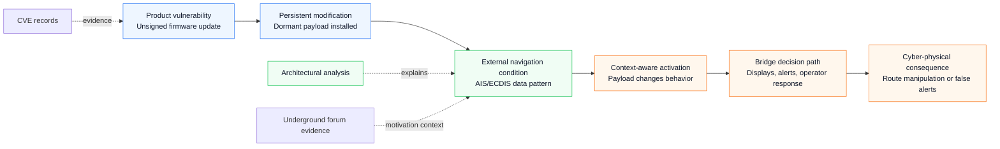
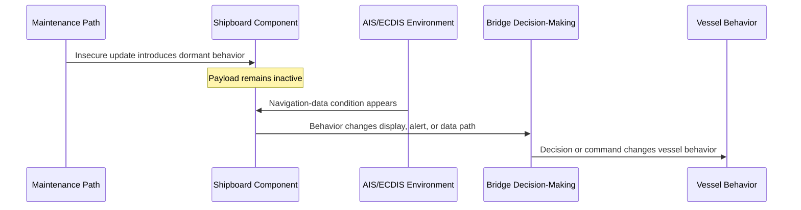

# Experimental Scenario Flow: Product Vulnerability Meets AIS/ECDIS Triggering

This experimental note mirrors the compact scenario-flow table in the article and adds a Mermaid diagram for GitHub rendering. It is meant as a visual supplement, not as a separate claim of exploitability.

## Scenario Table

| Stage | Example | Weakness Type | Role |
|---|---|---|---|
| Installation | Unsigned firmware update | Product vulnerability (CVE) | Persistence |
| Triggering | AIS/ECDIS trust assumptions | Architectural weakness | Activation |
| Execution | Dormant payload | Attack path | Malicious behavior |
| Outcome | Route manipulation, false alerts | Cyber-physical consequence | Operational impact |

## Mermaid Flow

## Mermaid Sequence View

