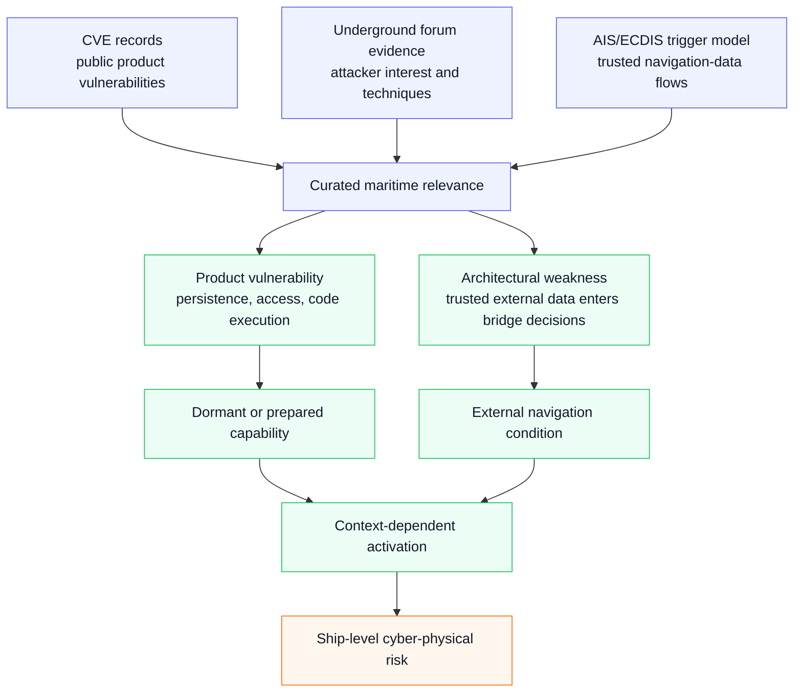
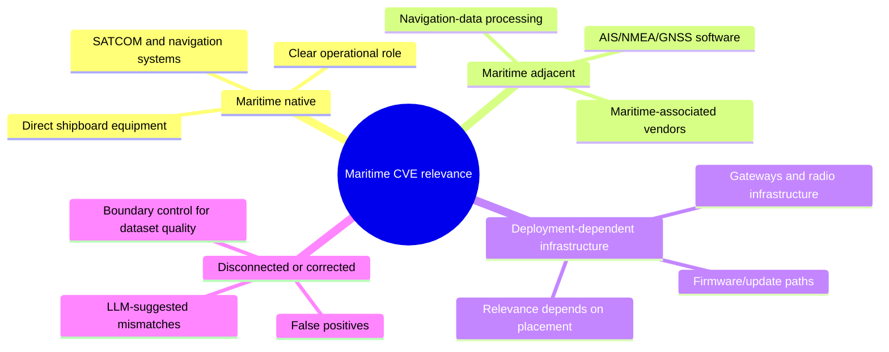
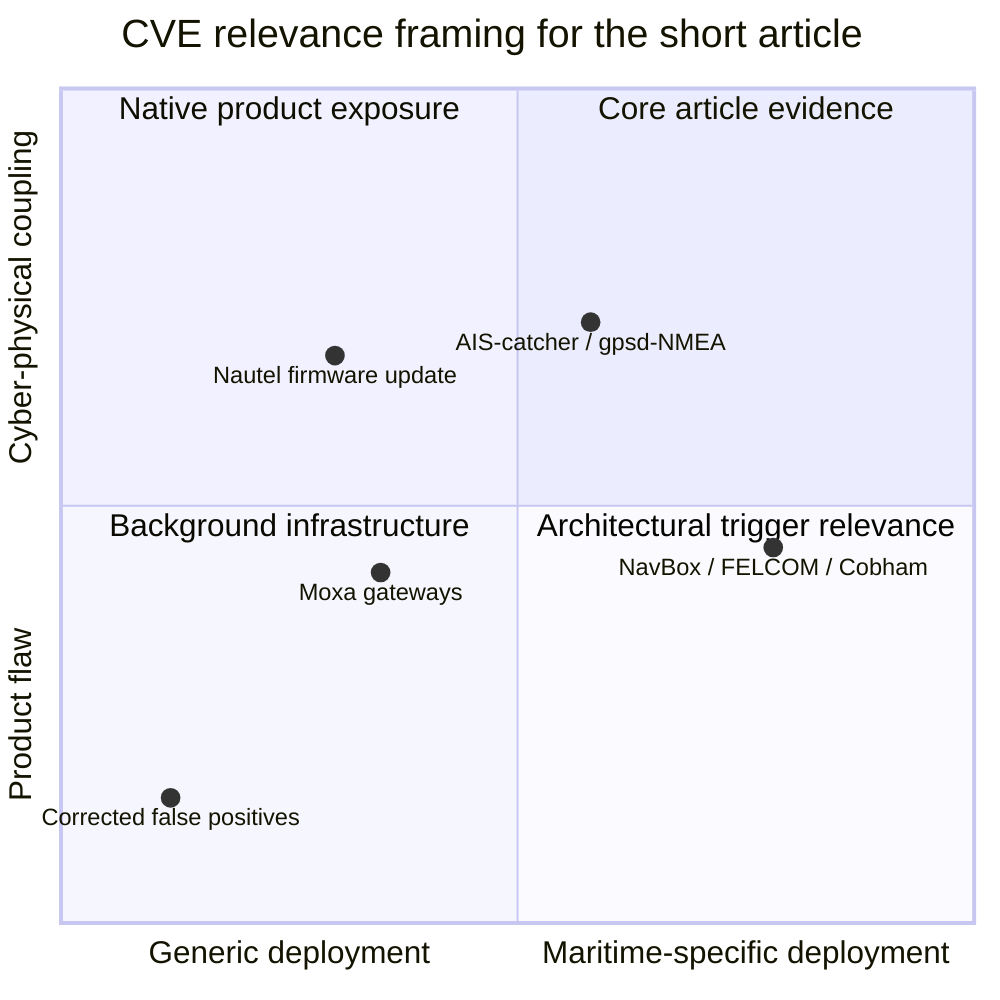
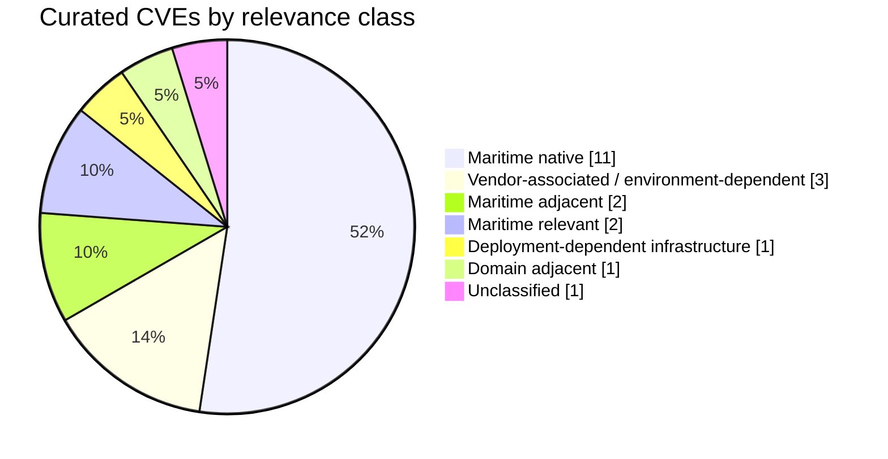
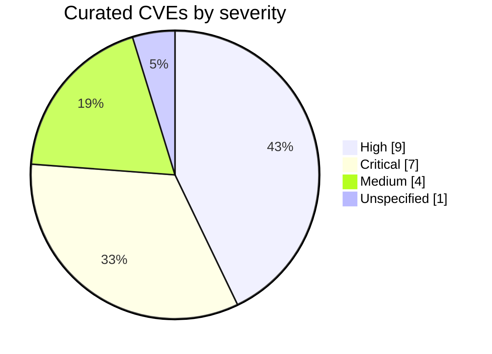
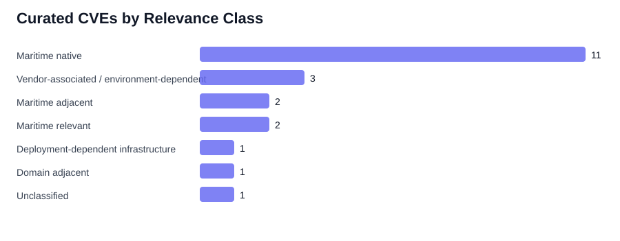
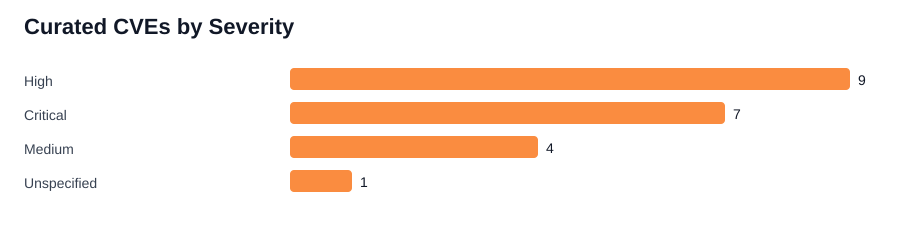
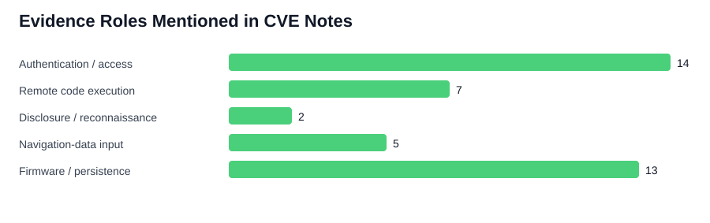

# Visual Explorations

This page collects experimental visual summaries derived from the supplementary CVE tables and research notes. The figures are exploratory: they are meant to suggest possible article figures, not to replace the curated tables.

## Evidence-to-Scenario Map

This is the cleanest candidate for the article because it explains the paper's logic without requiring the reader to inspect every CVE table.

## CVE Relevance Taxonomy

## Article-Framing Quadrant

This one is interpretive rather than empirical. It helps decide what belongs in the article body and what should remain in GitHub side material.

## Mermaid Count Sketches

## Generated SVG Charts

These SVGs are generated from `maritime-cve-research-notes.md` using a small standard-library Python script.

## Summary Tables

### Relevance Classes

| Class | Count |
| --- | --- |
| Maritime native | 11 |
| Vendor-associated / environment-dependent | 3 |
| Maritime adjacent | 2 |
| Maritime relevant | 2 |
| Deployment-dependent infrastructure | 1 |
| Domain adjacent | 1 |
| Unclassified | 1 |

### Severity

| Severity | Count |
| --- | --- |
| High | 9 |
| Critical | 7 |
| Medium | 4 |
| Unspecified | 1 |

### Evidence-Role Keywords

| Role | Count | Example CVEs |
| --- | --- | --- |
| Authentication / access | 14 | CVE-2026-2754, CVE-2018-16705, CVE-2018-16591, CVE-2018-16590 |
| Remote code execution | 7 | CVE-2025-66217, CVE-2013-2038, CVE-2025-28236, CVE-2019-9532 |
| Disclosure / reconnaissance | 2 | CVE-2019-9533, CVE-2013-6034 |
| Navigation-data input | 5 | CVE-2025-66217, CVE-2025-66216, CVE-2013-2038, CVE-2019-9534 |
| Firmware / persistence | 13 | CVE-2025-28236, CVE-2023-41086, CVE-2023-39429, CVE-2023-39222 |

## Notes

- The keyword chart is intentionally approximate. It counts whether a CVE note contains at least one keyword associated with each evidence role.
- The quadrant chart is interpretive rather than measured. It is useful for discussion and article-framing decisions, not as empirical evidence.
- The generated counts exclude the disconnected or corrected suggestions section, so the charts describe only the curated CVE notes.
